# 📊 Lab 10: Histograms and Quantiles

## 🎯 Scenario: The SLO Dashboard Project

> *Your product manager announces: "We're committing to SLOs for our API. We need to guarantee that 95% of requests complete in under 400ms. Can you build the queries to track this?"*
>
> In this lab, you'll learn to work with histogram metrics—the foundation of latency monitoring and SLO tracking. Histograms let you answer questions like "What's our p95 latency?" and "What percentage of requests meet our SLO?"

## Understanding Histogram Structure

Before diving into queries, let's understand how Prometheus histograms work:

```mermaid
flowchart TD
    A[📥 Observation<br/>e.g., request took 0.15s] --> B{Histogram Metric};

    subgraph Prometheus Histogram Components
        B --> C[_count<br/>Total observations];
        B --> D[_sum<br/>Sum of all values];
        B --> E[_bucket<br/>Cumulative counts];
    end

    C --> C1["prometheus_http_..._count = 1000<br/>(1000 total requests)"];
    D --> D1["prometheus_http_..._sum = 45.2<br/>(45.2 seconds total)"];

    E --> F{Buckets with 'le' label};
    F --> E1["bucket{le='0.1'} = 800<br/>(800 requests ≤ 100ms)"];
    F --> E2["bucket{le='0.4'} = 950<br/>(950 requests ≤ 400ms)"];
    F --> E3["bucket{le='1'} = 990<br/>(990 requests ≤ 1s)"];
    F --> E4["bucket{le='+Inf'} = 1000<br/>(all requests)"];

    style A fill:#f9f,stroke:#333
    style C fill:#ccf,stroke:#333
    style D fill:#ccf,stroke:#333
    style E fill:#ccf,stroke:#333
    style C1 fill:#afa,stroke:#333
    style D1 fill:#afa,stroke:#333
    style E1 fill:#afa,stroke:#333
    style E2 fill:#afa,stroke:#333
    style E3 fill:#afa,stroke:#333
    style E4 fill:#afa,stroke:#333
```



**Key Insight:** Buckets are *cumulative*! The `le="0.4"` bucket contains ALL requests that took ≤400ms, including those in smaller buckets.

## Objectives
- Understand histogram metrics and their bucket structure
- Learn how to use the histogram_quantile function for percentile analysis
- Analyze latency distributions with bucketing
- Calculate SLO-related metrics

## Instructions

1. **Explore Histogram Metrics:**
   ```promql
   # Examine the structure of a histogram metric
   prometheus_http_request_duration_seconds_bucket
   ```
   
   > **Explanation:** Histogram metrics have multiple time series with a `le` (less than or equal) label representing bucket boundaries. The value of each time series is the cumulative count of observations falling within that bucket.
   >
   > Look at the results—you'll see many time series with different `le` values. Each represents a bucket boundary.
   > 
   > ```promql
   > # Filter to see specific buckets for one handler
   > prometheus_http_request_duration_seconds_bucket{handler="/api/v1/query"}
   > ```

2. **Calculate Percentile Latencies:**
   ```promql
   # Calculate 95th percentile latency
   histogram_quantile(0.95, sum(rate(prometheus_http_request_duration_seconds_bucket[5m])) by (le))
   ```
   
   > **Explanation:** The `histogram_quantile` function calculates the specified quantile (0.95 = 95th percentile) from bucket data. This gives you the value below which 95% of observations fall.
   >
   > **Function Signature:** `histogram_quantile(φ float, b instant-vector)`
   > - `φ` is the quantile to calculate (0 to 1)
   > - `b` is a vector of bucket counts with the `le` label
   >
   > **Common Quantiles:**
   > | Quantile | Meaning |
   > |----------|---------|
   > | 0.5 | Median (50th percentile) |
   > | 0.9 | 90th percentile |
   > | 0.95 | 95th percentile |
   > | 0.99 | 99th percentile |

   > 📋 **Real-World Use Case:** "What latency do 95% of our users experience?" This is the standard SLO metric for most APIs.

3. **Analyze Latency by Handler:**
   ```promql
   # Calculate median (50th percentile) latency by handler
   histogram_quantile(0.5, sum by (handler, le) (rate(prometheus_http_request_duration_seconds_bucket[5m])))
   ```
   
   > **Explanation:** This query calculates the median latency for each handler separately by keeping the `handler` label during aggregation. This allows you to compare performance across different endpoints.

4. **Calculate SLO Compliance:**
   ```promql
   # Percentage of requests under 400ms (0.4s) SLO threshold
   (sum(rate(prometheus_http_request_duration_seconds_bucket{le="0.4"}[5m])) / sum(rate(prometheus_http_request_duration_seconds_count[5m]))) * 100
   ```
   
   > **Explanation:** This query calculates what percentage of requests complete within the 400ms SLO threshold. It divides the count of requests in the ≤0.4s bucket by the total count.
   >
   > **Important:** We use `le="0.4"` because this matches an actual histogram bucket boundary. Always check available bucket boundaries before setting SLO thresholds!
   >

   > **Note:** We use `le="0.4"` because this matches an actual histogram bucket boundary defined by Prometheus. Always check available bucket boundaries with `prometheus_http_request_duration_seconds_bucket` before setting SLO thresholds.
   >
   > You can also calculate the error rate (requests exceeding the SLO threshold):
   >
   > ```promql
   > # Percentage of requests exceeding 400ms SLO threshold
   > (1 - sum(rate(prometheus_http_request_duration_seconds_bucket{le="0.4"}[5m])) / sum(rate(prometheus_http_request_duration_seconds_count[5m]))) * 100
   > ```
   >
   > **SLO Components:**
   > - **SLI (Service Level Indicator)**: The actual measurement (request latency)
   > - **SLO (Service Level Objective)**: The target (e.g., 99% of requests < 400ms)
   > - **Error Budget**: Allowable amount of non-compliance (e.g., 1% of requests can exceed 400ms)

5. **Working with Gauge Metrics:**
   ```promql
   # Calculate rate of change for a gauge metric
   deriv(node_memory_Active_bytes{instance="localhost:9100"}[5m])
   ```
   
   > **Explanation:** The `deriv` function calculates the per-second derivative of a gauge metric, showing how quickly a gauge value is changing. Using a 5-minute window provides quick feedback in a lab setting while still being useful for understanding trends in resource usage.
   >
   > **Note:** While not a histogram function, `deriv` is important when analyzing the rate of change for metrics that aren't counters. Unlike counters which can use `rate()`, gauges need `deriv()` to find their rate of change.
   > 
   > **Predict future values** with linear prediction based on recent trends:
   >
   > ```promql
   > # Predict memory usage 5 minutes in the future
   > predict_linear(node_memory_Active_bytes{instance="localhost:9100"}[5m], 300)
   > ```

## Challenge

Create queries to analyze the behavior of Prometheus's HTTP API using the histogram metrics from `prometheus_http_request_duration_seconds_bucket` that you've already explored.

1. Compare the 90th percentile latency for different handlers to identify which endpoints are the slowest
2. Find the percentage of requests that take less than 0.1s for each handler
3. Create a query that shows both the median (50th) and 95th percentile latencies side by side

<details>
<summary>🧩 <b>Show Solution</b></summary>

### 1. Compare 90th percentile latency by handler:

```promql
# 90th percentile latency by handler
histogram_quantile(0.90, 
  sum by(handler, le) (
    rate(prometheus_http_request_duration_seconds_bucket[5m])
  )
)
```

This query:
- Groups by handler and bucket boundary (`le`)
- Calculates the rate of requests in each bucket
- Uses histogram_quantile to compute the 90th percentile for each handler
- Allows you to easily compare performance across different endpoints

### 2. Percentage of fast requests (<0.1s) by handler:

```promql
# Percentage of requests under 0.1s by handler
(
  sum by (handler) (rate(prometheus_http_request_duration_seconds_bucket{le="0.1"}[5m])) /
  sum by (handler) (rate(prometheus_http_request_duration_seconds_count[5m]))
) * 100
```

This query:
- Calculates what percentage of requests complete within 0.1 seconds for each handler
- Divides the count of requests in buckets under 0.1s by the total count
- Multiplies by 100 to get a percentage
- Helps identify which endpoints consistently provide fast responses

### 3. Compare median and 95th percentile side by side:

```promql
# Median and 95th percentile latencies side-by-side
label_replace(
  histogram_quantile(0.5, sum by(le) (rate(prometheus_http_request_duration_seconds_bucket[5m]))), 
  "quantile", "0.5", "", ""
) or label_replace(
  histogram_quantile(0.95, sum by(le) (rate(prometheus_http_request_duration_seconds_bucket[5m]))),
  "quantile", "0.95", "", ""
)
```

This query:
- Calculates both the median (0.5) and 95th percentile (0.95) latencies
- Uses `label_replace` to add a "quantile" label to each result
- Uses the `or` operator to combine the two time series
- Allows for easy comparison between typical and worst-case performance
- Helps visualize the difference between median and high percentile latencies

This analysis helps you understand:
- Which endpoints are consistently slow (high median latency)
- Which endpoints have inconsistent performance (large gap between median and 95th percentile)
- Which endpoints meet your latency SLOs and which need optimization

</details>

---

## 🌟 [Continue to Lab 11: Join Queries & Vector Matching](../Advanced/Lab11_Join_Queries_Vector_Matching.md)
Remember that mastering PromQL is an ongoing journey - the more you practice, the more effective you'll become at using Prometheus for observability and troubleshooting.
