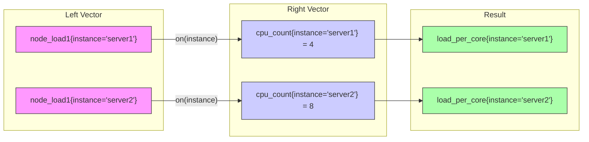

# 🔗 Lab 10: Join Queries & Vector Matching

## 🎯 Scenario: The Cross-Metric Investigation

> *Your infrastructure team asks: "We need to understand how different system metrics relate to each other. For example, is high network traffic correlated with memory pressure? How much load is each CPU core handling relative to the system's resources?"*
>
> In this lab, you'll learn PromQL's most powerful feature: joining metrics from different sources. This lets you correlate CPU with memory, network with disk, and build sophisticated capacity models.

## Understanding Vector Matching

When you perform operations between two metrics in PromQL, you need to tell it how to match the time series together:



## Objectives
- Master PromQL join operations and vector matching
- Learn different types of joins: one-to-one, one-to-many, many-to-one
- Practice using `on()`, `ignoring()`, `group_left`, and `group_right`
- Build complex queries that combine multiple metric families

## Instructions

### Part 1: Basic Vector Matching

1. **One-to-one matching with `on()`:**
   ```promql
   # Compare load average to CPU core count
   node_load1{instance="localhost:9100"} / on(instance) count by(instance) (node_cpu_seconds_total{instance="localhost:9100",mode="idle"})
   ```
   
   > **Explanation:** This query performs a one-to-one join on the `instance` label. It divides the 1-minute load average by the number of CPU cores for each instance.

   > 📋 **Real-World Use Case:** A load of 4.0 means different things on a 4-core vs 16-core system. This query normalizes load to "load per core"—values > 1.0 indicate CPU contention.

2. **One-to-one matching with `ignoring()`:**
   ```promql
   # Memory usage ratio ignoring job label differences
   node_memory_MemTotal_bytes{instance="localhost:9100"} / ignoring(job) node_memory_MemAvailable_bytes{instance="localhost:9100"}
   ```
   
   > **Explanation:** The `ignoring()` clause tells PromQL to ignore specific labels when matching vectors. Use this when metrics have extra labels that shouldn't affect the join.

### Part 2: Many-to-One Joins with group_left

When the left side has more time series than the right side, use `group_left` to allow multiple matches.

3. **Join network metrics with system memory using `group_left`:**
   ```promql
   # Network bandwidth per GB of system memory
   rate(node_network_receive_bytes_total{instance="localhost:9100",device!~"lo|veth.*"}[5m]) / on(instance) group_left() (node_memory_MemTotal_bytes{instance="localhost:9100"} / 1024^3)
   ```
   
   > **Explanation:** `group_left()` allows a many-to-one join where the left side (network interfaces—potentially multiple per server) joins with the right side (one memory value per server). The `device` label is preserved from the left side.

   > 📋 **Real-World Use Case:** "How much network bandwidth is each GB of RAM handling?" Useful for sizing network-intensive applications.

4. **CPU usage percentage per core:**
   ```promql
   # CPU usage percentage per core
   sum by(instance, cpu) (rate(node_cpu_seconds_total{instance="localhost:9100",mode!="idle"}[5m])) / on(instance, cpu) group_left() sum by(instance, cpu) (rate(node_cpu_seconds_total{instance="localhost:9100"}[5m])) * 100
   ```
   
   > **Explanation:** This calculates CPU utilization percentage per core by:
   > 1. Summing all non-idle CPU modes per core (numerator)
   > 2. Summing all CPU modes per core including idle (denominator)
   > 3. Matching by both `instance` and `cpu` labels

   > 
   > This pattern demonstrates how to aggregate first, then join for efficiency.

### Part 3: One-to-Many Joins with group_right

5. **System memory total with per-filesystem context using `group_right`:**
   ```promql
   # Total system memory with root filesystem context
   node_memory_MemTotal_bytes{instance="localhost:9100"} / on(instance) group_right(mountpoint,fstype) node_filesystem_size_bytes{instance="localhost:9100",mountpoint="/"}
   ```
   
   > **Explanation:** `group_right(mountpoint,fstype)` performs a one-to-many join where one memory total value is matched with filesystem entries, preserving the filesystem-specific labels from the right side. We filter to the root filesystem (`mountpoint="/"`) to ensure consistent behavior across different environments.

### Part 4: Complex Multi-Metric Joins

6. **CPU and memory efficiency ratio:**
   ```promql
   # System efficiency: CPU load vs available resources
   (node_load1{instance="localhost:9100"} / on(instance) count by(instance) (node_cpu_seconds_total{instance="localhost:9100",mode="idle"})) / on(instance) (node_memory_MemAvailable_bytes{instance="localhost:9100"} / node_memory_MemTotal_bytes{instance="localhost:9100"})
   ```
   
   > **Explanation:** This complex query combines CPU load efficiency (load per core) with memory availability to create an overall system efficiency metric. High values indicate the system is under load relative to available resources.

7. **Network throughput per CPU core:**
   ```promql
   # Network throughput efficiency per CPU core
   sum by(instance) (rate(node_network_transmit_bytes_total{instance="localhost:9100",device!="lo"}[5m])) / on(instance) count by(instance) (node_cpu_seconds_total{instance="localhost:9100",mode="idle"})
   ```
   
   > **Explanation:** This query calculates network throughput per CPU core by joining aggregated network metrics with CPU core counts. This can help identify whether network performance is CPU-bound.

### Part 5: Advanced Join Patterns

8. **Filesystem capacity planning with memory context:**
   ```promql
   # Available filesystem space as percentage of total system memory
   (node_filesystem_free_bytes{instance="localhost:9100",mountpoint="/"} / on(instance) node_memory_MemTotal_bytes{instance="localhost:9100"}) * 100
   ```
   
   > **Explanation:** This interesting join compares available disk space to total system memory, which can be useful for capacity planning in containerized environments where filesystem and memory constraints interact.

9. **Boolean join for system health check:**
   ```promql
   # Systems with both high load AND low memory
   (node_load1{instance="localhost:9100"} > on(instance) count by(instance) (node_cpu_seconds_total{instance="localhost:9100",mode="idle"})) and on(instance) ((node_memory_MemTotal_bytes{instance="localhost:9100"} - node_memory_MemAvailable_bytes{instance="localhost:9100"}) / node_memory_MemTotal_bytes{instance="localhost:9100"} > 0.8)
   ```
   
   > **Explanation:** This boolean join identifies instances where load exceeds CPU count AND memory usage is above 80%. Using `and on(instance)` ensures both conditions must be true for the same instance.

### Part 6: Performance Considerations

10. **Efficient aggregation before join:**
    ```promql
    # Better: Aggregate first, then join
    avg by(instance) (rate(node_cpu_seconds_total{instance="localhost:9100",mode!="idle"}[5m])) / on(instance) (node_memory_MemAvailable_bytes{instance="localhost:9100"} / node_memory_MemTotal_bytes{instance="localhost:9100"})
    ```
    
    > **Explanation:** When possible, aggregate metrics before joining to reduce the number of time series that need to be matched. This query aggregates CPU usage across all cores before joining with memory metrics, which is more efficient than joining raw CPU metrics.

## Challenge: Multi-Service Resource Correlation

Can you write a query that joins CPU usage, memory usage, and network throughput to identify the most resource-efficient instances? Your query should:
- Calculate CPU usage percentage
- Calculate memory usage percentage  
- Include network throughput (bytes/sec)
- Combine all three metrics for instances with the same labels
- Return a score where lower numbers indicate better efficiency

<details>
<summary>🧪 <b>Show Solution</b></summary>

```promql
# Multi-metric efficiency score (lower is better)
(
  # CPU usage %
  (100 * (1 - avg by(instance) (rate(node_cpu_seconds_total{instance="localhost:9100",mode="idle"}[5m])))) 
  + 
  # Memory usage %
  (100 * (1 - (avg by(instance) (node_memory_MemAvailable_bytes{instance="localhost:9100"}) / avg by(instance) (node_memory_MemTotal_bytes{instance="localhost:9100"}))))
  +
  # Network throughput (normalized to MB/s)
  (sum by(instance) (rate(node_network_transmit_bytes_total{instance="localhost:9100",device!="lo"}[5m])) / 1024 / 1024)
) / on(instance) 
# Normalize by system capacity (CPU cores + memory GB)
(
  count by(instance) (node_cpu_seconds_total{instance="localhost:9100",mode="idle"}) +
  avg by(instance) (node_memory_MemTotal_bytes{instance="localhost:9100"}) / 1024 / 1024 / 1024
)
```

> **Explanation:** This advanced query:
> 1. Combines CPU %, memory %, and network throughput (MB/s) as a resource consumption score
> 2. Uses `avg by(instance)` to aggregate memory metrics to match the instance-only label set
> 3. Normalizes the result by system capacity (CPU cores + memory in GB)
> 4. Lower scores indicate more efficient resource usage
> 5. Demonstrates how complex business logic can be built using PromQL joins
>
> **Key insight:** When joining metrics with different label sets, aggregate them to a common label set first using `avg by()`, `sum by()`, or similar aggregations.

**Alternative approach - Simpler efficiency ratio:**
```promql
# Simple efficiency: load per available memory GB
node_load1{instance="localhost:9100"} / on(instance) (node_memory_MemAvailable_bytes{instance="localhost:9100"} / 1024 / 1024 / 1024)
```

</details>

## Best Practices for PromQL Joins

1. **Always specify matching strategy**: Use `on()` or `ignoring()` explicitly
2. **Aggregate before joining**: Reduce cardinality when possible
3. **Use group_left/group_right sparingly**: They can be expensive operations
4. **Match on stable labels**: Avoid joining on volatile labels like timestamps
5. **Test query performance**: Complex joins can impact query time
6. **Consider recording rules**: Pre-compute expensive joins for dashboards

---

## 🎉 Congratulations! You've Completed the PromQL Labs!

You've now mastered a comprehensive set of PromQL skills, from basic queries to advanced vector matching and joins. These skills will be invaluable for effective monitoring, alerting, and troubleshooting of your systems using Prometheus.

### � Final Challenge

Before you go, take the [Advanced Checkpoint Quiz](Quiz_Advanced_Checkpoint.md) to test your mastery!

### �🏆 Skills You've Gained:
- ✅ Basic metric queries and label filtering
- ✅ Rate calculations and aggregations
- ✅ Memory, filesystem, and network monitoring
- ✅ Anomaly detection and correlation
- ✅ Recording rules and alerting
- ✅ Label manipulation and time-based analysis
- ✅ Histogram analysis and SLO calculations
- ✅ Vector matching and complex joins

### 🚀 What's Next?
- Apply these concepts to your own infrastructure metrics
- Create Grafana dashboards using your new PromQL skills
- Implement SLOs for your services
- Share your knowledge with your team!


